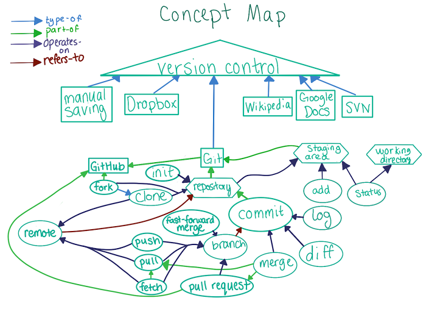

# FAQ Progress

### 9/26/2017

**Completed**:

[X] [How to Use Git and GitHub](https://www.udacity.com/course/how-to-use-git-and-github--ud775)
  * Finally finished this course. Huzzah! Lesson 3 primarily focused on working with Github, learning how to push and pull from repositories, and learning about the open source community and how you can participate in it.

  [X] **Lesson 3**:

  - I learned that the `origin` in `git remote add origin url` referred to the name you were giving to your remote repository. I did not know you could change that name. Actually... In my bootcamp, I do remember deploying an app to Heroku and I may have called that remote Heroku, but that was only because the directions on Heroku said to do it. I didn't know why I did it.

     - For example, when talking about working with a forked repository they said that people typically call that remote "upstream". You would accomplish that by running `git remote add upstream url`.

  - That actually goes into a broader conversation. I don't know *WHY* I do certain things as a programmer. Why did I do something a certain way, why I implement something with one technique as opposed to another. The *WHY* is something I want to learn because I believe that knowing the why gives an individual tremendous power. I suppose this is why I enjoy the speaker Simon Sinek. He always talks about knowing your own "why." In any given field, I think there are very few people who can be considered "elite." I think this is the case in programming as well. A lot of people know what to do, but they don't know the background of why they are doing something. I believe that knowing that why something occurs is a part in what makes those people excel (aside from the obvious things like talent and effort). I will learn my why, not just as a programmer, but more broadly as a human and a man as well. As a programmer, I believe knowing the why will empower me to be more efficient and be more knowledgable. As a human being I think it will allow me to figure out why I do the things that I do and empower me to get better. That is ultimately what I'm here for.

  - I've never run a `.sh` file via the `bash` command to update a repository on GitHub. I didn't know that was possible. I don't really know what happened, but it updated a [forked repository](https://github.com/ShugKnight24/recipes) on Github to make it look like someone collaborated with me. This was done to illustrate how to resolve a [conflict](https://github.com/ShugKnight24/recipes/commit/909199955ecf823300bd4d2449f29f7c85408031) that was pushed to a remote repository but was not on your local machine yet. I want to learn more about how that command worked because that was pretty awesome!

  - They spoke a little bit about `git fetch`. I typically just `git pull` to automatically have Git merge for me, but I may try using `git fetch origin`, comparing the changes with `git diff`, and merge afterwards.

  - I never realized that origin/master and master were different things when it came to your repository. I should have realized this. Origin/master is the last commit in common between your local repo and the remote repo. This is good to know.

  - They had a good explanation of fast-forward merges. They described it as "it requires the branch that you are merging into to be an ancestor of the branch you are merging from." This succinct explanation really made sense to me and clicked.

  - I enjoyed practicing with forking and merging. I don't fork repositories all to often, so that was good to get some more practice with. I eventually want to get good enough to where I can feel like I can comfortably and competently contribute to an open source repository. Being more practiced with merging is also great because I never want to ruin a coworkers work. So that was great too.

  - The course kept a concept map that they would add to throughout and use to help reinforce newly learned topics. I really enjoyed it. Here is the final version of it.

  

  - Finally, the course has you contribute to a [Create Your Own Adventure](https://github.com/udacity/create-your-own-adventure) repository. I haven't done that yet, but I plan on it. I will update this document when I have completed that.
    - **Updated**: I saw the amount of pull requests open on that repository and there hasn't been a commit in nearly 9 months, so I will probably not be contributing. I'll see if they update this in future.

**Thoughts**:

I really enjoyed this course. It has been a really long time since I've completed a MOOC but this experience was awesome. I really enjoyed improving my knowledge, but I think I enjoyed tracking my own progress and growth even more. I think this helped me retain more of the information I encountered, and it also kept me extremely motivated while going through the course material. There wasn't a chance I was giving up or not completing. My progress was out in the wild. My reputation is on the line. Even if this document will not be viewed by a single soul, it wouldn't matter. The very thought that someone could somehow stumble upon the repository I created, updated a handful of times, and then quickly abandoned terrifies me. This may speak to my inner perfectionist. Or perhaps public shaming. Merp. Anyway, I've tremendously enjoyed this process and I know that I've gotten better, specifically with Git, in the past couple of days.

The fact that I've been enjoying doing this just motivates me to do more and get even better. There is something about steadily pushing yourself to self-improvement that is contagious. At least for me there is. I hope to continue pushing out regular content and updates to my progress. I'm excited to see how much I can get myself to grow as a developer in the upcoming weeks and months! To continually getting better and reaching that next level!

I will continue with P1xt's FAQ guide tomorrow.

Until then, fare thee well,

Shug =]
