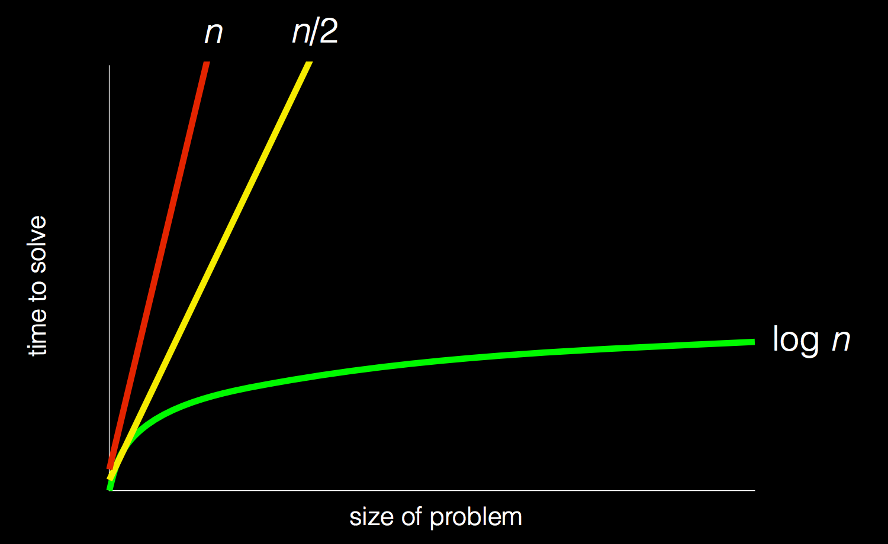

# JavaScript Job Ready Progress

### 10/11/2017

Today I finally began CS50. It was great to get started going through this awesome course. I've really enjoyed listening to instructor David Malan thus far. Excited to keep going and learn as much as possible.

**Completed**:

- [X] Week 0 Lecture of [CS50](https://www.edx.org/course/introduction-computer-science-harvardx-cs50x)

  - The CS50 YouTube Channel has been putting out the 2017 CS50 course lectures. Unfortunately, the EDX course still uses the 2016 course videos. Since pretty much all of the course content on EDX revolves around the older material, I'll be watching the 2016 lectures and doing the accompanying work. I may pick up some of the newer videos when I do cardio at the gym or to review material I found challenging the first go around.

  - "What ultimately matters in this course is not so much where you end up relative to your classmates, but where you in week 11, the end of the semester, end up relative to yourself in week 0" - David Malan

    - What an absolutely brilliant quote. I love this type of approach. This is pretty much the mindset I try to adopt whenever I attempt to learn a new skill or improve an old one. It is challenging for me to put my ego aside, but at the end of the day I know that the only person I am truly competing with is myself. I want to be better and smarter at the end of the day than I was at the start of the day. I know that this is easier said than done. I'm a pretty competitive person and this has caused me to struggle at many times in my life. I compare myself to other people and where they are currently at. I shall do my best to integrate this approach and method of thinking and only compare my progress to who I used to be. This will hopefully allow me to appreciate how far I've come.

  - At its core computer science and programming is about problem solving.

    - This is one thing I realized quickly in the bootcamp I attended. People who were good problem solvers were able to quickly transition into learning the fundamentals of programming. Yes picking up the nuances and syntax of a language may prove to be a larger challenge, but the core is solving problems and thinking critically.

  - You take an input, do something, and you get to your desired output. The "do something" portion can be thought of as algorithm.

  - **Binary**:

    - *Unary* - One letter in your alphabet

    - *Binary* - Two letters in your alphabet

      - Computers understand 0s and 1s

      - It was pretty cool having binary explained in this simple and easy to understand manner. I heard about binary when I was growing up and imagined it to be such an incredibly complex topic. I was somewhat shocked at how simple it was. It is exactly the same as the power of 10 we use to keep track of mathematical operations except everything is based off of the power of 2.

      - *Bit* - A binary digit

      - *Byte* - 8 bits

      - Both the example with the lamps and the example on the board were extremely helpful to visualize binary and how you can continue to count.

    - *Decimal* - Where you have ten letters in your alphabet

      - *Dec*

  - **ASCII**: American Standard Code for Information Interchange

    - The numerical representation of certain letters

  - **RGB**: Red, Green, Blue. All between 0 and 255. Combined, they give you a specific color

  - All of the things we see today were abstracted from the lowest level up to the highest level.

  - **Intro to Algorithms**:

    - First discusses how attendance would be taken manually. You can increase the number that you count by. Ultimately, you want to get to a point where you can do this type of calculation logarithmically. You want to optimize how you approach these problems much like how we want to how we write our code to optimize for what we are attempting to accomplish.

      - The attendance example was a great introduction to conditional logic.

    - Next he goes over an example of finding a specific name within a phone book.

      - *Algorithm* - An algorithm is essentially a step by step approach to solving a particular problem.

      - Really great example of how you can rip the phone book in half and look to see if the person you are looking is on that page. If not, you would have to determine which side of the phone book they would be in. You will repeat this process until you eventually find the person you are looking for. You also have to take into consideration the edge case that, that person might not be in that phone book. This is a great technique because it works logarithmically. Even if you double the dataset you are working with, at most, you only have to take one more additional action to find the person you are looking for.

      

      - Here is the logic described above
        ```
        pick up phone book
        open to middle of phone book
        look at names
        if Smith is among names
            call Mike
        else if Smith is earlier in book
            open to middle of left half of book
            go back to step 2
        else if "Smith" is later in book
            open to middle of right half of book
           go back to step 2
        else
           quit
        ```

      - *Functions* - procedures or actions your code takes

      - *Conditions* - decision points in your code

      - *Boolean expressions* - questions your code asks

      - *Looping* - Basic technique to do a repetitive task

      - The key with writing good code is not how you can solve a problem, but how can you solve that problem in the *best* possible manner.

        - This is not something I'm particularly good at right now. Algorithmic thinking is a skill I definitely need to improve upon. Going down this path is something I'm extremely excited to do because I believe it will teach me how to think more programmatically and solve my problems in a more efficient manner.

    **Staff Intros**:

      - One of the staff members, Zamyla, mentioned the "Aha moment". This one of the most euphoric moments for me when OI am programming. Solving a problem that had you stumped or helping someone who hit a wall with a problem they were trying to solve is an absolutely amazing feeling.

    **Scratch**:

      - Developed by MIT to help tech students and children learn the fundamentals of programming and how to think like a computer.

      ``` c

        #include <stdio.h>

        int main(void)
        {
            printf("hello, world\n");
        }

      ```

      - Scratch is an online editor that allows you to drag and drop puzzle pieces of code and attach them to sprites to have them take certain actions. The typical keywords of a programming language are essentially replaced with specific puzzle pieces.

      - An interesting point about breaking your problems up into smaller more manageable chunks was brought up. This is good advice in general, but definitely true in programming. This is something I need to get better at. I sometimes realize that I was not at the smallest step I could take at that given point, which can lead to me having to approach the problem in a different man.

        - Building up in incremental steps

        - Building something small and continually adding features to improve upon in.

      - While building the initial loop to play the meow sound, he mentions using better practices while coding. Specifically, he mentions having less redundant code. I've noticed this about my own programming. I used to, and still occasionally write repetitive code. I've noticed myself getting better about placing those types of things into more modular functions so I can reuse my code.

        - Abstraction

          - Something I think that I need to get better at. I envy CS graduates because I believe that many of them possess this skill. They gained it through learning the fundamentals and theory of computer science. This is what I'm honestly hoping to get from this process. I want to learn how to think and code better. I know that my ability to think abstractly will get better with practice and time.

          - The examples he goes over of breaking a bit of code into the most basic pieces so it can handle all scenarios is incredible. The way it is shown and conveyed is so simple. This is fundamentally true. Really fascinating to see how simple these things can be no matter how frightening they may look at first.

      - I think the concept of Scratch is pretty awesome. It's a really simple and intuitive manner on how programming works at its core. I am really excited to jump into it and create a program with it tomorrow.

**Thoughts**: The instructor for CS50, David Malan, is absolutely awesome! This guy has so much passion and enthusiasm for computer science. It just oozes from the screen when you watch him lecture. His approach and delivery makes learning this subject matter so much fun. It's absolutely contagious. I envy the students who are fortunate enough to have him in person. The first lesson was a great primer for what is to come in the course and I'm excited to go through the Scratch work, and get started with this course.

As always, thanks for getting here. I'd appreciate any feedback you have for me so that I can continue to get better.

Until [next time](10_12_17.md),

Shug =]
